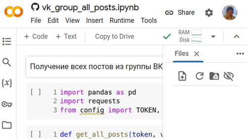

# How to connect to VK API and run *.ipynb scripts at Google Colab

In order to use for example vk_group_all_posts.ipynb you need to:
1. Clone this GitHub project to your computer.
2. Rename the file src/vk/config.example.py to config.py without "example".
3. Open [dev.vk.com](https://dev.vk.com), create VK application and get the token (pictured).
4. Paste your token into the file *config.py*.
5. In Google Colab, upload the config.py file to session storage (pictured).

|  | 
|:--:| 
| Step 2: ...get the *Service token* at dev.vk.com |

|  | 
|:--:| 
| Step 4: Upload *config.py* file to Google Colab session storage |
